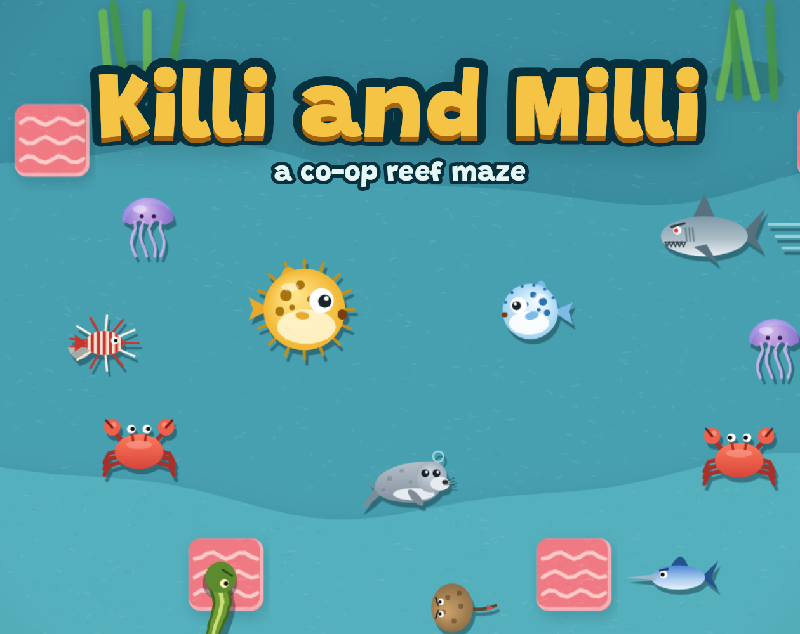

# Killi and Milli



A co-op arcade maze game about two pufferfish gathering snacks for the reef's Moonlight Feast while crabs, eels, stingrays and the Kraken Queen close in. A spiritual successor to Nitrome's *Bad Ice-Cream*: grow and break walls of coral, puff up to protect yourself, and bring a friend.

Play it: https://devindyson.com/pufferpanic/ (also at https://ddyson1.github.io/pufferpanic/)
Wiki: https://ddyson1.github.io/pufferpanic/wiki/
itch.io: https://devindyson.itch.io/killi-and-milli

## What's in the game

- 18 levels: 16 reefs that each introduce one creature, snack or hazard, with Bruiser the shark guarding the way down after the twelfth and the Kraken Queen waiting at the bottom.
- One or two players. In co-op, a caught fish returns when the next wave of snacks appears, and the reef only restarts if both are caught.
- Nine creatures, seven snacks, six terrain types including currents and erupting vents, and Niko the seal, who hands out bubble shields.
- Scoring with streaks, best times, and one to three stars per level.
- Choose Killi or Milli and customize them. Most colors, patterns and accessories are earned by clearing levels, beating bosses, or long-term goals.
- An illustrated story intro, boss cards, and an ending.
- Four visual looks (Cut paper is the default), four sound packs and five music loops, all synthesized in the browser. The game ships no audio files. Music by default changes with the reef you are on.
- One layout scaled as a whole, so it fits any window, an itch.io embed or a phone, with the info strip above the board only during play.

## Controls

| | Swim | Coral | Puff |
|---|---|---|---|
| 1 player | Arrows or WASD | Space | Shift |
| 2 players, Killi | WASD | Space (or F) | Left Shift (or G) |
| 2 players, Milli | Arrows | Option or Alt (or /) | Right Shift (or .) |

P pauses, R restarts. On touch devices an on-screen pad and buttons appear; two-player mode needs a keyboard.

## Project layout

```
index.html             The whole game: one self-contained file (HTML, CSS, JavaScript)
wiki/index.html        The wiki: one self-contained file with images embedded
manifest.webmanifest   Installable-app manifest (Add to Home Screen on iOS and Android)
sw.js                  Service worker for offline play; bump CACHE when releasing
icons/                 App icons
marketing/             Store copy, key art and covers, screenshots, and a character reference sheet
tools/                 Generators: wiki, screenshots and icons, the cast cover, all rendered from the game
tests/                 jsdom suites that drive the real game and render frames
LAUNCH.md              The release plan, phase by phase
```

There is no build step. The game runs as an installable web app when served over HTTPS, and its `Ads` adapter talks to the Poki or CrazyGames SDK when one is loaded, and does nothing otherwise. Open `index.html` in a browser, or serve the folder with any static server (for example `npx serve .`). Fonts load from Google Fonts, so the pages look best online.

Levels are plain text maps in the `LEVELS` array near the top of `index.html`. The legend is in the comment above it: `#` rock, `c` coral, `P` and `Q` the two start positions, digits for snack waves, letters for creatures and terrain. Add a map and a `waves` list and the level appears in the level select.

## Development

`npm install` once, then:

| Command | What it does |
|---|---|
| `npm run test:quick` | The quick suite, about three minutes. Run it after any change. |
| `npm run test:gameplay` | Adds randomized playthroughs of every level in both modes, about five minutes. Run it before a release. |
| `npm run test:audio` | Renders every sound effect offline and prints peak levels. |
| `npm run wiki` | Regenerates `wiki/index.html` and its images from the game. |
| `npm run assets` | Regenerates the icons and the first six screenshots. |
| `npm run cover` | Renders the cast cover from the game into `marketing/cast-cover-*.png`. |
| `npm run itch` | Zips the game for itch.io. |

Tests write images to `tests/out/`; look at them when a change is visual.

## Hosting with GitHub Pages

Settings, Pages, deploy from the `main` branch, root folder. The game is then at the repository's Pages address and the wiki at `/wiki/`.

## Credits

Design, art, code and music by Devin Dyson. Built with help from Claude.

## License

All rights reserved. See `LICENSE`. The source is published so people can read and learn from it, not so it can be redistributed or sold.
